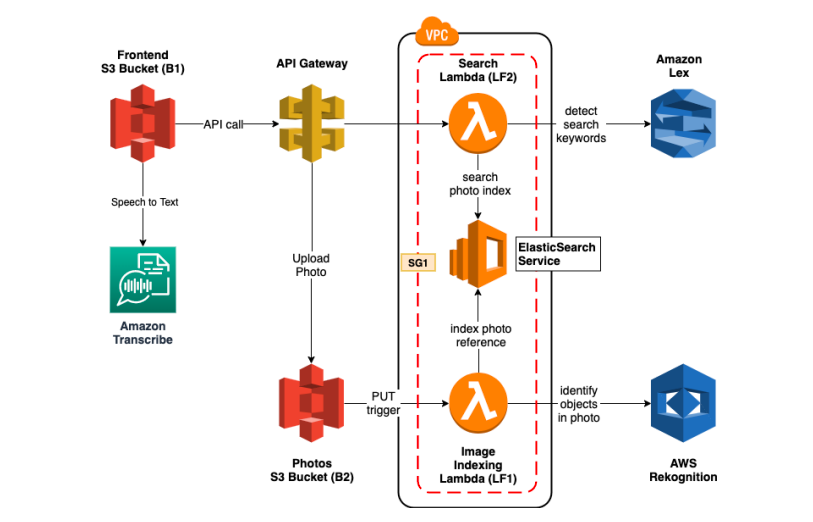

# VoiceEnabledPhotoAlbum
## Description
A serverless photo album web application that can be used to upload pictures. Pictures can also be searched using natural language through both text and voice.

## Architecture Diagram

## AWS Components

***S3 Bucket***

We have 2 S3 buckets, one hosting the frontend (ur2136-jk4534-b1) and one used to store images (ur2136-jk4534-b2).

We also have buckets created by lambda pipelines : lambda-pipeline-ur2136 and code pipeline-us-east-1-448124621562.

We have one bucket created by the frontend pipeline : tademowebsite-ur2136.

We have kept the buckets independent and separate of each other so that any existing functionality is not compromised.

***API Gateway***

We have 2 calls /GET to /search and /PUT to /upload/{bucket}{item} and we are using an API key to connect to both of these APIs. API key had to be added to the usage limit for it to be working without giving authorization issues. We also set up Lambda that searches photos as Proxy for /GET call and S3 bucket of pictures as proxy for /PUT call. Enabling CORS was an important step as well.

***Lambdas, Lex and AWS Rekognition***

We have Lambdas : search-photos and index-photos. search-photos lambda gets the user text/transcribed text input from the frontend and sends it to LEX BOT (PhotoBotFinal) that disambiguates the query and extracts keywords out of the search query. These query words are then searched on the elastic search domain and if results are found, the frontend is populated with the results.
Index-photos is configured on a PUT trigger, such that every time an object(image) gets added to S3 bucket for photos, it gets invoked and we also invoke AWS Recognition to detect labels.

We also have index-photos-copy and search-photo-copy that are the lambda functions that are being built and deployed by ONLY codepipeline and cloud formation.

We also get two new lambda functions searchPhotosFunctional and indexPhotoFunctional once we run the cloud formation the template to create the functions which pick these code from.

***CloudFormation***

CF_Lambda_Template.json is the overall template file for AWS resources (lambda, API gateway, S3 buckets)
api-gateway.yaml is an extra file which is used ONLY for API Gateway

***CloudPipeline***

We have frontendPipeline using which deploy the front end code to S3 bucket tademowebsite and lambdaPipelineNew to deploy the lambda functions.
The files buildspex.yml inside frontendcode and buildspec.yml, samTemplate.yaml inside lambda folder are templates used to implement CI/CD pipeline.
